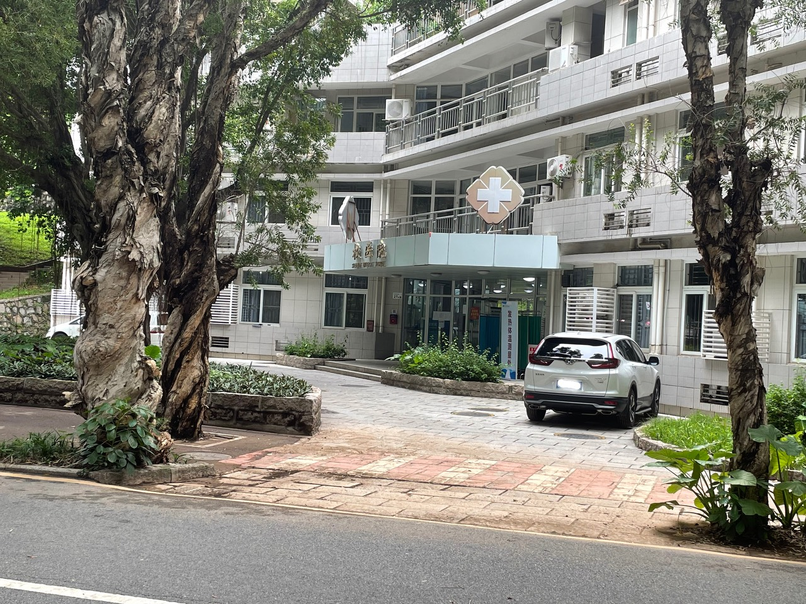

# 地点 & 建筑

## :material-gate: 校门 

!!! tip 
	学校的地标经历了一次重命名，笔者看了看地图上的地名...没几个认识的 :sweat_smile:
	特别是某几个校门的名称之间只有一字之差，不仅学生分不清，送餐人员也容易看错。需要特别注意：在`打车`、`点外卖`时，正确选择地点。如遇送餐小哥  / 送餐姐姐将餐品错误配送，也希望各位能多多谅解。

### 立功门（北门）

| 地图       | :material-map-marker: 标记                                   |
| ---------- | ------------------------------------------------------------ |
| 高德地图   | [深圳大学北门](https://uri.amap.com/marker?position=113.93944,22.538773&name=深圳大学北门&src=friesclipartdocs&coordinate=gaode&callnative=1) |
| 百度地图   | [深圳大学北门](http://api.map.baidu.com/marker?location=22.544415,113.945967&title=深圳大学北门&content=标记点&output=html&src=friesclipartdocs) |
| Google Map | [深圳大学（北门）](https://goo.gl/maps/RfaX9Z6R8ZjU22o68)    |
| Apple Map  | [深圳大学粤海校区（北门）](https://maps.apple.com/?address=%E4%B8%AD%E5%9B%BD%E5%B9%BF%E4%B8%9C%E7%9C%81%E6%B7%B1%E5%9C%B3%E5%B8%82%E5%8D%97%E5%B1%B1%E5%8C%BA%E6%B7%B1%E5%8D%97%E5%A4%A7%E9%81%93&auid=1118368933210472&ll=22.538773,113.939440&lsp=57879&q=%E6%B7%B1%E5%9C%B3%E5%A4%A7%E5%AD%A6%E7%B2%A4%E6%B5%B7%E6%A0%A1%E5%8C%BA(%E5%8C%97%E9%97%A8)) |

### 立言门

立言门位于白石路粤海校区一侧

| 地图       | :material-map-marker: 标记                                   |
| ---------- | ------------------------------------------------------------ |
| 高德地图   | [深圳大学立言门](https://uri.amap.com/marker?position=113.938067,22.529393&name=深圳大学立言门&src=friesclipartdocs&coordinate=gaode&callnative=1) |
| 百度地图   |                                                              |
| Google Map |                                                              |
| Apple Map  |                                                              |

### 立德门

| 地图       | :material-map-marker: 标记                                   |
| ---------- | ------------------------------------------------------------ |
| 高德地图   | [深圳大学立德门](https://uri.amap.com/marker?position=113.932798,22.532902&name=深圳大学立德门&src=friesclipartdocs&coordinate=gaode&callnative=1) |
| Google Map |                                                              |
| Apple Map  |                                                              |

### 立业门（西门）

| 地图       | :material-map-marker: 标记                                   |
| ---------- | ------------------------------------------------------------ |
| 高德地图   | [深圳大学立业门](https://uri.amap.com/marker?position=113.929909,22.527693&name=深圳大学立业门&src=friesclipartdocs&coordinate=gaode&callnative=1) |
| Google Map |                                                              |
| Apple Map  |                                                              |

### 小南门（桂庙通道）

| 地图       | :material-map-marker: 标记                                   |
| ---------- | ------------------------------------------------------------ |
| 高德地图   | [深圳大学小南门](https://uri.amap.com/marker?position=113.933122,22.526657&name=深圳大学小南门&src=friesclipartdocs&coordinate=gaode&callnative=1) |
| Google Map |                                                              |
| Apple Map  |                                                              |

### 立心门（小东门）

!!! warning
	该校门目前暂停使用

| 地图       | :material-map-marker: 标记                                   |
| ---------- | ------------------------------------------------------------ |
| 高德地图   | [深圳大学小东门](https://uri.amap.com/marker?position=113.942756,22.537078&name=深圳大学小东门&src=friesclipartdocs&coordinate=gaode&callnative=1) |
| Google Map |                                                              |
| Apple Map  |                                                              |

### 立志门

!!! warning
	该条目目前缺少相关信息，无法确认是否处于可用状态  <del>说人话就是我没去过这个地方</del>

| 地图       | :material-map-marker: 标记                                   |
| ---------- | ------------------------------------------------------------ |
| 高德地图   | [深圳大学立志门](https://uri.amap.com/marker?position=113.936446,22.538879&name=深圳大学立志门&src=friesclipartdocs&coordinate=gaode&callnative=1) |
| Google Map |                                                              |
| Apple Map  |                                                              |

### 致远门

立言门位于白石路南校区（沧海校区）一侧

| 地图       | :material-map-marker: 标记                                   |
| ---------- | ------------------------------------------------------------ |
| 高德地图   | [深圳大学致远门](https://uri.amap.com/marker?position=113.938327,22.529086&name=深圳大学致远门&src=friesclipartdocs&coordinate=gaode&callnative=1) |
| Google Map |                                                              |
| Apple Map  |                                                              |

:material-map-search-outline: 周边关联

### 致新门（东北门）

| 地图       | :material-map-marker: 标记                                   |
| ---------- | ------------------------------------------------------------ |
| 高德地图   | [深圳大学东北门](https://uri.amap.com/marker?position=113.94267,22.530676&name=深圳大学东北门&src=friesclipartdocs&coordinate=gaode&callnative=1) |
| Google Map |                                                              |
| Apple Map  |                                                              |

:material-map-search-outline: 周边关联

春笛、夏筝、秋瑟、冬筑、CoCo、全家、超市

### 致恒门（南门）

!!! Info
	:material-clock-time-one-outline: 致恒门开放时间为 `8:00` - `19:30`	

致恒门位于致原楼（物光楼）后面。:smile:

- 

| 地图       | :material-map-marker: 标记                                   |
| ---------- | ------------------------------------------------------------ |
| 高德地图   | [深圳大学致恒门](https://uri.amap.com/marker?position=113.938285,22.525095&name=深圳大学致恒门&src=friesclipartdocs&coordinate=gaode&callnative=1) |
| Google Map |                                                              |
| Apple Map  |                                                              |

:material-map-search-outline: 周边关联

### 致诚门（东门）

!!! warning
	该校门目前暂停使用

| 地图       | :material-map-marker: 标记                                   |
| ---------- | ------------------------------------------------------------ |
| 高德地图   | [深圳大学东门](https://uri.amap.com/marker?position=113.94267,22.530676&name=深圳大学东门&src=friesclipartdocs&coordinate=gaode&callnative=1) |
| Google Map |                                                              |
| Apple Map  |                                                              |

## :material-food: 食堂 

### 实验餐厅

| 地图       | :material-map-marker: 标记                                   |
| ---------- | ------------------------------------------------------------ |
| 高德地图   | [实验餐厅](https://uri.amap.com/marker?position=113.93846,22.533948&name=实验餐厅&src=friesclipartdocs&coordinate=gaode&callnative=1) |
| Google Map |                                                              |
| Apple Map  |                                                              |

### 荔山餐厅

| 地图       | :material-map-marker: 标记                                   |
| ---------- | ------------------------------------------------------------ |
| 高德地图   | [荔山餐厅](https://uri.amap.com/marker?position=113.938173,22.533887&name=荔山餐厅&src=friesclipartdocs&coordinate=gaode&callnative=1) |
| Google Map |                                                              |
| Apple Map  |                                                              |

### 荔天餐厅

| 地图       | :material-map-marker: 标记                                   |
| ---------- | ------------------------------------------------------------ |
| 高德地图   | [荔天餐厅](https://uri.amap.com/marker?position=113.938432,22.533791&name=荔天餐厅&src=friesclipartdocs&coordinate=gaode&callnative=1) |
| Google Map |                                                              |
| Apple Map  |                                                              |

### 听荔餐厅（教工餐厅）

| 地图       | :material-map-marker: 标记                                   |
| ---------- | ------------------------------------------------------------ |
| 高德地图   | [教工餐厅](https://uri.amap.com/marker?position=113.934095,22.534364&name=深大教工餐厅&src=friesclipartdocs&coordinate=gaode&callnative=1) |
| Google Map |                                                              |
| Apple Map  |                                                              |

### 沧海餐厅（南区食堂）

| 地图       | :material-map-marker: 标记                                   |
| ---------- | ------------------------------------------------------------ |
| 高德地图   | [深圳大学沧海校区食堂](https://uri.amap.com/marker?position=113.940937,22.530098&name=深圳大学沧海校区食堂&src=friesclipartdocs&coordinate=gaode&callnative=1) |
| Google Map |                                                              |
| Apple Map  |                                                              |

### 晨风餐厅（老西南餐厅）

| 地图       | :material-map-marker: 标记                                   |
| ---------- | ------------------------------------------------------------ |
| 高德地图   | [老西南餐厅](https://uri.amap.com/marker?position=113.931436,22.528093&name=老西南餐厅&src=friesclipartdocs&coordinate=gaode&callnative=1) |
| Google Map |                                                              |
| Apple Map  |                                                              |

### 凯风餐厅（新西南餐厅）

| 地图       | :material-map-marker: 标记                                   |
| ---------- | ------------------------------------------------------------ |
| 高德地图   | [新西南餐厅](https://uri.amap.com/marker?position=113.930752,22.528155&name=新西南餐厅&src=friesclipartdocs&coordinate=gaode&callnative=1) |
| Google Map |                                                              |
| Apple Map  |                                                              |

### 小西南餐厅

| 地图       | :material-map-marker: 标记                                   |
| ---------- | ------------------------------------------------------------ |
| 高德地图   | [小西南餐厅](https://uri.amap.com/marker?position=113.932079,22.527729&name=小西南餐厅&src=friesclipartdocs&coordinate=gaode&callnative=1) |
| Google Map |                                                              |
| Apple Map  |                                                              |

## :material-home: 宿舍

### 红豆斋

## :material-hospital-box: 医疗

### 校医院

{: .image  loading="lazy" width="500"}

校医院位于南秋馆（游泳池）的隔壁

| 地图       | :material-map-marker: 标记                                   |
| ---------- | ------------------------------------------------------------ |
| 高德地图   | [深圳大学校医院](https://uri.amap.com/marker?position=113.938647,22.532389&name=深圳大学校医院&src=friesclipartdocs&coordinate=gaode&callnative=1) |
| Google Map |                                                              |
| Apple Map  |                                                              |

## :fontawesome-solid-running: 体育场馆

## :material-library-shelves: 图书馆

### 汇典楼（图书馆北馆）

| 地图       | :material-map-marker: 标记                                   |
| ---------- | ------------------------------------------------------------ |
| 高德地图   | [深圳大学小南门](https://uri.amap.com/marker?position=113.933122,22.526657&name=深圳大学小南门&src=friesclipartdocs&coordinate=gaode&callnative=1) |
| Google Map |                                                              |
| Apple Map  |                                                              |

### 汇智楼（图书馆南馆）

| 地图       | :material-map-marker: 标记                                   |
| ---------- | ------------------------------------------------------------ |
| 高德地图   | [深圳大学小南门](https://uri.amap.com/marker?position=113.933122,22.526657&name=深圳大学小南门&src=friesclipartdocs&coordinate=gaode&callnative=1) |
| Google Map |                                                              |
| Apple Map  |                                                              |

## :fontawesome-solid-chalkboard-teacher: 教学区域

## :material-information-outline: 其他

