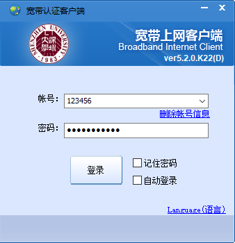

# 服务 & 设施

## 校园网

### 如何登陆校园网？

方式1：Web

 1. 访问 

    [http://172.30.255.2/a30.htm](http://172.30.255.2/a30.htm) （宿舍区）

    [https://drcom.szu.edu.cn](https://drcom.szu.edu.cn/)       （教学区）

    

 2. 填写校园网的账号密码，然后点击登陆

    {: .image  loading="lazy" width="300" }

 3. OK，成功上网

    {: .image  loading="lazy" width="500" }

方式2：客户端

1. 下载 Dr.com 客户端
    * [Windows](https://www1.szu.edu.cn/temp/Dr.com_szu_Ver5.2.0_20180727.zip)
    * [Mac](https://www1.szu.edu.cn/temp/DrClientNS.student.20201118.zip)
    * [Linux（图形界面版）](https://www1.szu.edu.cn/temp/DrClient(DrcomAndPPOE).zip)[^1]

[^1]:  亲测在 Ubuntu 20.04 上可用，但是[内部网](https://www1.szu.edu.cn/nc/view.asp?id=64)提供的命令行版本似乎有点问题

2. 打开下载的压缩包，双击运行

    {: .image  loading="lazy" width="300" }

3. 输入帐号（校园卡号）和密码，点击登陆
4. 登陆成功

    {: .image  loading="lazy" width="300" }

方式3：cURL命令行:material-console:

{: .image  loading="lazy" width="500" }

1. 打开命令行 / Terminal

2. 复制下方命令，将命令中的 ` 校园卡号` ` 校园卡密码` 替换为你的账号密码
    ~~~ bash
    curl -X POST -d "DDDDD=校园卡号&upass=校园卡密码&0MKKey=%B5%C7%A1%A1%C2%BC" http://172.30.255.2/a30.html  
    ~~~
    
    例子如下
    ~~~ bash
    curl -X POST -d "DDDDD=123456&upass=password123&0MKKey=%B5%C7%A1%A1%C2%BC" http://172.30.255.2/a30.html  
    ~~~
    
3. 将修改后的命令粘贴到命令行，回车运行

!!!tip 
    此登陆方式原理同方式1，向认证服务发送 POST 请求。适用于在没有图形化界面的机器上登陆校园网，前提是已经安装了curl。如果你使用软路由，可以写一个 shell 脚本挂在路由器上。

方式4：第三方客户端

有兴趣的同学可以自行搜索

Github相关项目：

* [drcoms/drcom-generic](https://github.com/drcoms/drcom-generic)
* [mchome/dogcom](https://github.com/mchome/dogcom)
* ...

### 如何续费？

## :fontawesome-solid-running: 运动设施

### 游泳

####  南秋馆（海边游泳池）
粤海校区南区运动广场南秋馆（原海边游泳池）

#### 北夏馆（北区游泳池）
粤海校区北区北夏馆（原北区新游泳池）

### 羽毛球

#### 南体东馆羽毛球场
粤海校区南区运动广场东馆羽毛球场

### 壁球

#### 南体西馆壁球馆
粤海校区南区运动广场西馆一楼壁球馆

### 篮球

#### 南体天台篮球场
粤海校区南区运动广场天台篮球场

#### 南体东馆室内篮球场
粤海校区南区运动广场东馆室内篮球场

### 排球

#### 西馆排球场
粤海校区南区运动广场西馆一楼排球场

### 乒乓球

#### 北区乒乓球馆
粤海校区北区至柔馆（原小球馆）2楼乒乓球馆

### 健身

#### 南区西馆一楼健身房
粤海校区南区运动广场西馆一楼健身房
#### 南区西馆二楼健身房
粤海校区南区运动广场西馆二楼健身房

### 网球

#### 北区网球场

粤海校区北区至柔馆（原小球馆）3楼网球场

#### 南区海边网球场
粤海校区南区运动广场海边网球场

### 足球

#### 海边足球场
粤海校区南区运动广场海边足球场

#### 天台足球场
粤海校区南区运动广场天台足球场

### 棒垒球

#### 南体天台棒垒球场
粤海校区南区运动广场天台足球场

### 保龄球
#### 深圳大学保龄球馆
粤海校区北区至柔馆（原小球馆）1楼

### 高尔夫
#### 高尔夫教学练习场
粤海校区北门附近

